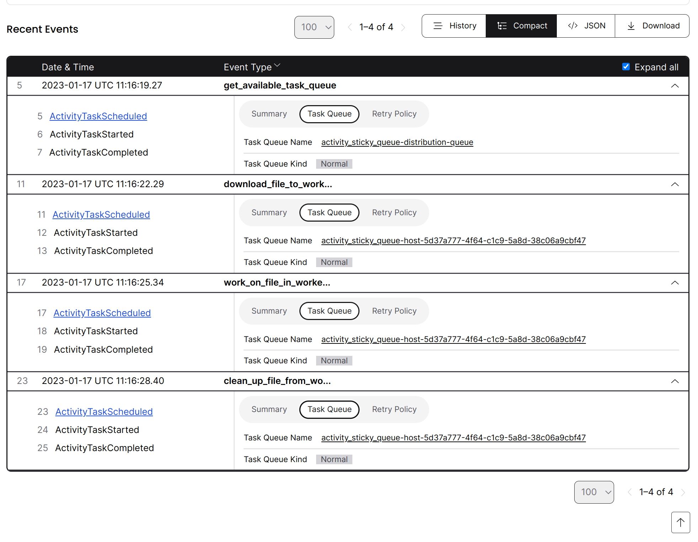

# Sticky Activity Queues

This sample is a Python implementation of the [Node "Sticky Workers" example](https://github.com/temporalio/samples-typescript/tree/main/activities-sticky-queues), full credit for the design to the authors of that sample. A [sticky execution](https://docs.temporal.io/tasks#sticky-execution) is a job distribution design pattern where all workflow computational tasks are executed on a single worker. In the Golang Temporal SDK this is explicitly supported via the Session option, but in other SDKs a different approach is required. 

Typical use cases for sticky executions include tasks where interaction with a filesystem is required, such as data processing or interacting with legacy access structures. This example will write text files to folders corresponding to each worker, located in 

This implementation will follow the Node example:
- Create a `get_available_task_queue` activity that generates a unique task queue name, `unique_worker_task_queue`.
- For activities intended to be "sticky", only register them in one Worker, and have that be the only Worker listening on that `unique_worker_task_queue`. This will be run on a series of `FileProcessing` workflows.
- Execute workflows from the Client like normal. Check the Temporal Web UI to confirm tasks  were staying with their respective worker.

It doesn't matter where the `get_available_task_queue` activity is run, so it can be "non sticky" as per Temporal default behavior. In this demo, `unique_worker_task_queue` is simply a `uuid` initialized in the Worker, but you can inject smart logic here to uniquely identify the Worker, [as Netflix did](https://community.temporal.io/t/using-dynamic-task-queues-for-traffic-routing/3045). Our example differs from the Node sample by running across 5 unique task queues.

Activities have been artificially slowed with `time.sleep(3)` to simulate slow activities.

### Running This Sample

1. `temporal server start-dev` to start [Temporal Server](https://github.com/temporalio/cli/#installation).
1. `poetry install` to install dependencies (if you haven't already as part of initialising the repo).
1. `poetry run python worker.py` to start the Worker.
1. In another shell, `poetry run python starter.py` to initiate the Workflow.

#### Example output:

```bash
(temporalio-samples-py3.10) user@machine:~/samples-python/activities_sticky_queues$ poetry run python starter.py 
Output checksums:
b3fc767460efa514753a75e6f3d7af97
b3fc767460efa514753a75e6f3d7af97
b3fc767460efa514753a75e6f3d7af97
b3fc767460efa514753a75e6f3d7af97
b3fc767460efa514753a75e6f3d7af97
b3fc767460efa514753a75e6f3d7af97
b3fc767460efa514753a75e6f3d7af97
b3fc767460efa514753a75e6f3d7af97
b3fc767460efa514753a75e6f3d7af97
b3fc767460efa514753a75e6f3d7af97
```

<details>
<summary>Checking the history to see where activities are run</summary>
All activities for the one workflow are running against the same task queue, which corresponds to unique workers:



</details>


